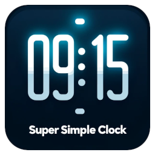

# Super Simple Clock for VS Code

A super simple, open source status-bar clock for Visual Studio Code.

There seem to be lots of status bar clock extensions around, but nearly all of
them are closed-source?  Something so simple should surely be free and open --
so here we go.

## Installation

Install through the Visual Studio Code Marketplace:
https://marketplace.visualstudio.com/items?itemName=chrisjdavies.super-simple-clock

## Configuration

|Property|Description|Type|Default value|
|---|---|---|---|
|`clock.format24Hour`|Display a 24-hour clock instead of a 12-hour one.|Boolean|`true`|

## Thanks

- Thanks to DALL-E 3 for generating the icon/logo.
